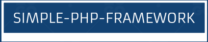

<p align="center">
  
</p>

# Your Simple PHP Framework

[](LICENSE)

Welcome to Your Simple PHP Framework! 🚀

Your Framework is an educational PHP framework thoughtfully designed to assist you in learning web development. It serves as a valuable resource to enhance your PHP knowledge and deepen your understanding of web application development.

## Features

- **Hands-On Learning**: Gain practical experience by exploring framework fundamentals.
- **Easy Routing**: Define routes effortlessly and map them to controllers and actions.
- **MVC Architecture**: Follow the Model-View-Controller pattern for clean and organized code.
- **Flexible Configuration**: Configure your application settings and database connections with ease.
- **Template Engine**: Use a built-in template engine or integrate your preferred one.
- **Middleware Support**: Implement middleware for handling requests and responses.
- **Database Interaction**: Simplify database operations with a database abstraction layer.
- **Customizable**: Extend and customize the framework to experiment with various features.

## Getting Started

Follow these simple steps to start your educational journey:

1. **Clone the Repository**: Begin by cloning this repository to your local machine.

   ```shell
   git clone https://github.com/your-username/your-framework.git
   ```

2. **Install Dependencies**: Use Composer to install project dependencies.

   ```shell
   composer install
   ```

3. **Configuration**: Configure your application settings in `config.php` and set up your database connection.

4. **Routing**: Define your routes in `routes.php` and map them to controllers and actions.

5. **Build**: Create controllers, views, and models as needed to explore web development concepts.

6. **Learn and Experiment**: Dive into the framework's codebase to learn how web applications work.


## Contributing

This project welcomes contributions! Feel free to open issues, submit pull requests, or provide feedback to help improve the educational content and functionality of this framework.

## License

This project is licensed under the MIT License - see the [LICENSE](LICENSE) file for details.

---

Enjoy your journey of learning with Your Simple PHP Framework! Happy coding! 🚀
```

This updated README emphasizes that the framework is primarily for learning purposes and encourages users to explore and experiment with web development concepts.
